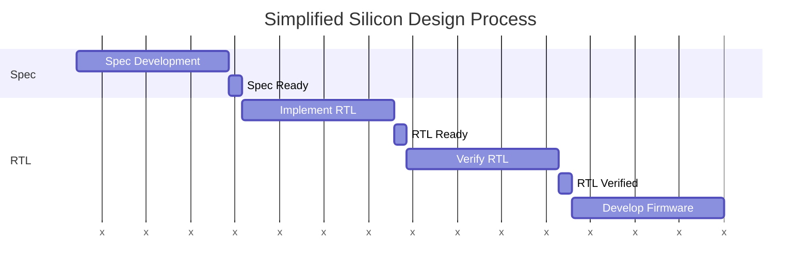
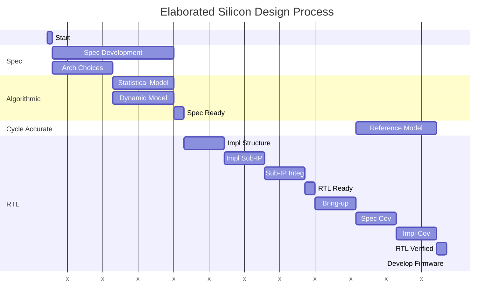
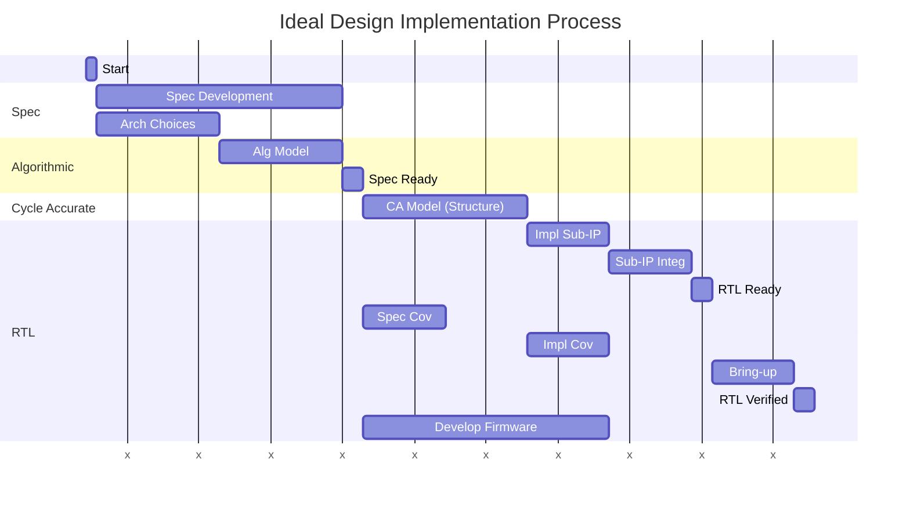

"Shift-Left" is a strategy to reorganize processes to enable more parallelism 
by adjusting dependencies. Hardware model abstractions provide a key tool to
shifting tasks left in the silicon design process.

<!--more-->

# A simplified silicon design process





The gantt chart above illustrates a simplified silicon design process. It
deliberately makes no attempt to assign accurate relative times to any step
in the process. The key challenge is that starting most steps is gated by
the previous step either completing, or reaching some fairly advanced state
of readiness. For example, the DV team can't really start verifying the 
design until RTL is available. They can study the spec and, perhaps even,
write some tests speculatively while the RTL is under development. But, 
validating assumptions must wait until RTL exists.

Note that these tasks are grouped by the design-model abstraction
level, with most activity centering around a register-transfer-level (RTL) 
model of the design. This poses several challenges, but one of the biggest
is that the abstraction difference between Spec and RTL is enormous. 

# A closer look

While the diagram above is straightforward, it hides some useful details
about what is actually happening during each of the steps above.

Let's walk through to look at the changes. First, you'll notice that 
there are now four abstraction levels:
- **Spec** - Typically a natural-language description
- **Algorithmic** - A behavioral model with limited timing fidelity
- **Cycle Accurate** - A behavioral (non-synthesizable) model that reflects the 
  intended micro-architecture of the design
- **RTL** - Synthesizable model

## Spec Development

During spec development, it's natural to use some high-level models to
validate assumptions. These models are captured at a high level of
abstraction, and support one of two methods of evaluation. A model
intended for dynamic evaluation will be behavioral, and supports 
activities such as running existing software workloads. A statistical
model (e.g. an Excel sheet) enables what-if analysis by adjusting 
control parameters. These are typically two distinct models because 
of the two different evaluation approaches.

## RTL Implementation

The RTL development process is also not a monolith. Generally, you could
think of a process by which the design is partitioned into independent
sub-IP that can be implemented by different engineers. Once the design
is partitioned, engineers can work in parallel to implement and test
their assigned sub-IP. Finally, sub-IPs are integrated back into the
overall structure of the design.

## Design Verification

The design verification process is also step-wise, typically starting
with basic bring-up tests to ensure that simple operations, such as 
register accesses, make it past the interfaces and properly interact 
with the design. Verification then proceeds to exercise key device
usescases and, finally, exercise key implementation details.

The DV team will often create some type of reference model or predictor
to use in checking results from the design. Sometimes this will be 
cycle accurate, but it might also be at an algorithmic level of abstraction.

Looking in more detail, it becomes clear that modeling at different abstarction
levels is being done. But, too often, these models are only used within a specific
silo. There are many reasons for this, including the language(s) used to implement
models and integration challenges. 

# Shifting Left with Model Reuse

The Zuspec 'bet' is that we can reorganize the silicon development process by making models
easier to create, easier to reuse and transform, and easier to integrate. Future posts will
go into more depth on how Zuspec enables this. For now, let's look at how different modeling
abstractions are used across the silicon development process.

Let's look at some of the key points:
- A single algorithmic model is used to serve both dynamic (simulation) and
  static/formal evaluation during the spec development process.
  - The DV team can use this algorithmic model, with a few modifications, as a 
    substitute for RTL while they setup the testbench environment and write 
    tests that exercise the specified design behavior.
   - The Firmware team can also get started writing firmware using the 
     algorithmic model. 
- The RTL implementation team develops a cycle-accurate model of the design
  as part of the process of partitioning the design. 
  - The RTL implementation team selectively replaces sub-IPs within the 
    cycle-accurate model to test a particular sub-IP's implementation together
    with the more-abstract remainder of the design model.
  - The DV team can move to running their tests against the more-accurate 
    model. This helps to highlight different interpretations of the spec 
    much earlier.
  - The DV team can also run their tests against various configurations
    of the hybrid cycle accurate / RTL model of the device to begin 
    exercising sub-IPs prior to availability of the fully-integrated RTL.
    Doing this can also enable tests that target implementation coverage 
    to be developed incrementally as the relevant sub-IPs are ready.
- Once the RTL is ready, the DV team proceeds to run bring-up activities. 
  Final issues are much easier to track down because the tests are known
  to run against the cycle-accurate model and various combinations of
  RTL sub-IPs. 

So, how much time will we save? That, of course, heavily depends on the 
relative size of the tasks shown above, as well as on the cost
of creating the set of models used above. But, the savings should be
significant.

# Next Stes

We've looked at several implementation abstraction levels for device models. 
In the next post, we'll dig into interface abstraction levels and see how
these enable incremental refinement of models.
